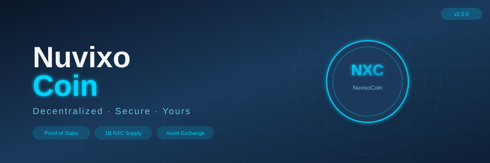
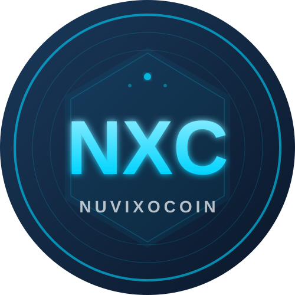
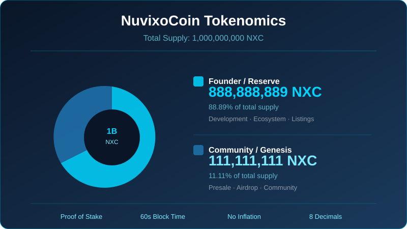
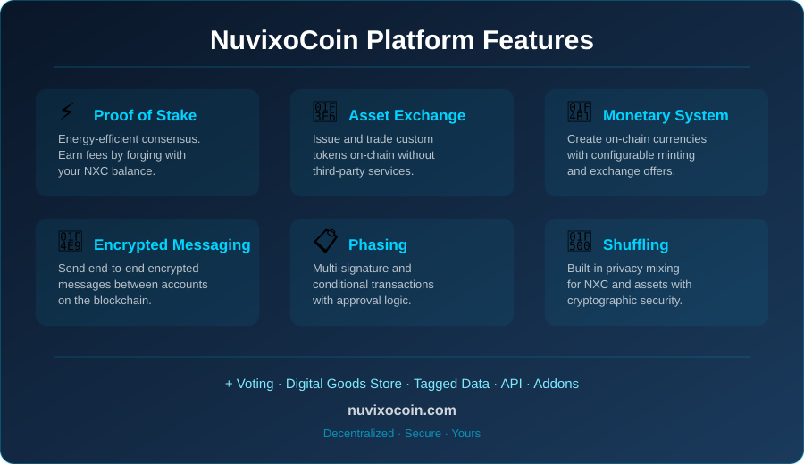

<div align="center">
  
  
  # NuvixoCoin (NXC)

  **A decentralized Proof-of-Stake blockchain platform**

  [](https://github.com/yourusername/nuvixocoin/releases)
  [](https://adoptium.net/)
  [](LICENSE.txt)
  []()

  [Website](#) · [Block Explorer](#) · [Whitepaper](#) · [Discord](#) · [Telegram](#)
</div>

---

## What is NuvixoCoin?

NuvixoCoin (NXC) is a decentralized Proof-of-Stake cryptocurrency and blockchain platform built on the battle-tested NXT codebase. It provides a secure, energy-efficient, and feature-rich ecosystem for digital value transfer and decentralized applications.

### Key Features

- **⚡ Proof of Stake** — Energy-efficient block generation. No mining hardware required. Earn transaction fees by forging with your NXC balance.
- **🔒 Secure by Design** — Curve25519 cryptography, 8-decimal precision, and a fixed supply of 1 billion NXC with no inflation.
- **🏦 Built-in Asset Exchange** — Issue and trade custom assets on-chain without third-party services.
- **💱 Monetary System** — Create on-chain currencies with configurable rules, minting, and exchange offers.
- **🛒 Digital Goods Store** — Buy and sell digital products directly on the blockchain.
- **🗳️ Voting & Polling** — On-chain governance with flexible voting models.
- **🔀 Shuffling** — Built-in privacy mixing for NXC and assets.
- **📩 Encrypted Messaging** — Send end-to-end encrypted messages between accounts.
- **📋 Phasing** — Multi-signature and conditional transactions with advanced approval logic.

---

## Token Information

| Property | Value |
|---|---|
| Ticker | NXC |
| Total Supply | 1,000,000,000 NXC |
| Decimals | 8 |
| Consensus | Proof of Stake |
| Block Time | 60 seconds |
| Block Rewards | Transaction fees only (no inflation) |
| Peer Port | 27874 |
| API Port | 7876 |

### Token Distribution

| Allocation | Amount | % |
|---|---|---|
| Community / Genesis accounts | 111,111,111 NXC | 11.11% |
| Founder / Reserve wallet | 888,888,889 NXC | 88.89% |
| **Total** | **1,000,000,000 NXC** | **100%** |

---

## Getting Started

### Requirements

- Java 17 or higher (OpenJDK recommended)
- 2 GB RAM minimum (4 GB recommended)
- 10 GB disk space

### Quick Start (Linux / macOS)

```bash
# 1. Clone the repository
git clone https://github.com/yourusername/nuvixocoin.git
cd nuvixocoin

# 2. Install Java 17 (Ubuntu/Debian)
sudo apt update && sudo apt install -y openjdk-17-jdk

# 3. Compile
./compile.sh

# 4. Configure (copy the example and set your admin password)
cp conf/examples/nxt.properties.example conf/nxt.properties
# Edit conf/nxt.properties and set nxt.adminPassword=your_strong_password

# 5. Run
./run.sh
```

### Quick Start (Windows)

```bash
# 1. Install Java 17 from https://adoptium.net/
# 2. Double-click compile.bat
# 3. Double-click run.bat
```

### Access the Wallet

Once running, open your browser at:
```
http://localhost:7876
```

---

## Configuration

Copy `conf/nxt.properties.example` to `conf/nxt.properties` and customize:

```properties
# Required — generate with: openssl rand -base64 32
nxt.adminPassword=your_strong_admin_password_here

# Your public IP (optional, helps peers find you)
nxt.myAddress=your.ip.address.here

# Known peers (add your bootstrap nodes here)
nxt.wellKnownPeers=node1.nuvixocoin.com;node2.nuvixocoin.com
```

> ⚠️ **Never commit `conf/nxt.properties` to version control.** It is in `.gitignore` by default.

---

## Build with Gradle

For a modern build with automatic dependency management:

```bash
# Install Gradle wrapper (one-time)
gradle wrapper --gradle-version 8.7

# Build (produces the app + all dependency jars, kept separate — see
# MIGRATION-LOG.md for why this is deliberate rather than a single fat jar)
./gradlew installDist

# Run
./build/install/nuvixocoin/bin/nuvixocoin
```

For CVE scanning, use the standalone [OWASP Dependency-Check CLI](https://github.com/dependency-check/DependencyCheck/releases)
against `build/install/nuvixocoin/lib/` rather than a Gradle plugin — see
`MIGRATION-LOG.md` for why the Gradle plugin route was dropped.

To package for transfer to a server:
```bash
./gradlew distZip
# produces build/distributions/nuvixocoin-2.0.0.zip — unzip it on the
# target machine and run bin/nuvixocoin the same way
```

---

## Running a Public Node

To run a publicly accessible node on a VPS:

```bash
# Open firewall ports
sudo ufw allow 27874/tcp   # P2P
sudo ufw allow 7876/tcp    # API (optional — only if you want public API access)

# Run in background
nohup ./run.sh > /dev/null 2>&1 &
```

---

## API

The NuvixoCoin API is accessible at `http://localhost:7876/nxt`:

```bash
# Get blockchain status
curl "http://localhost:7876/nxt?requestType=getBlockchainStatus"

# Get account balance
curl "http://localhost:7876/nxt?requestType=getAccount&account=NXC-XXXX-XXXX-XXXX-XXXXX"

# Get forging status (requires admin password)
curl "http://localhost:7876/nxt?requestType=getForging&adminPassword=your_password"
```

Full API documentation: [http://localhost:7876/test](http://localhost:7876/test)

---

## Security

- Admin API is password-protected — set `nxt.adminPassword` before going public
- API server binds to `127.0.0.1` by default (localhost only)
- CORS is disabled by default
- Peer server has DoS filtering (30 requests/sec limit)
- All cryptography uses Curve25519 and SHA-256

To report a security vulnerability, please email **security@nuvixocoin.com** privately. Do not open a public issue.

---

## Contributing

1. Fork the repository
2. Create a feature branch: `git checkout -b feature/my-feature`
3. Commit your changes: `git commit -m "Add my feature"`
4. Push: `git push origin feature/my-feature`
5. Open a Pull Request

Please read [DEVELOPERS-GUIDE.md](DEVELOPERS-GUIDE.md) before contributing.

---

## License

NuvixoCoin is based on the NXT Reference Software by Jelurida.

- Original NXT code: Copyright © 2013-2016 The Nxt Core Developers
- NxtClone framework: Copyright © 2016-2025 Jelurida IP B.V. / Jelurida Swiss SA
- NuvixoCoin modifications: Copyright © 2025 NuvixoCoin Developers

Distributed under the [Jelurida Public License (JPL) v2.0](LICENSE.txt).

---

## Acknowledgements

NuvixoCoin is built on the shoulders of the NXT project and the Jelurida team's open-source work. We thank the entire NXT community for building and maintaining this technology since 2013.

---

<div align="center">
  <b>NuvixoCoin — Decentralized. Secure. Yours.</b>
</div>

---

## Project Assets

| Asset | Preview |
|---|---|
| Banner |  |
| Logo |  |
| Tokenomics |  |
| Features |  |
